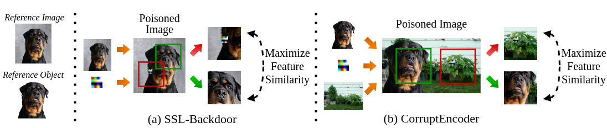

## Official Implementation of CorruptEncoder (CVPR 2024)

## Introduction

This repo is the official implementation of CorruptEncoder in pytorch. 

For any other implementation details, please refer to our paper **Data Poisoning based Backdoor Attacks to Contrastive Learning**. (CVPR 2024) [[Paper](https://arxiv.org/pdf/2211.08229.pdf)]

Code will come soon!

